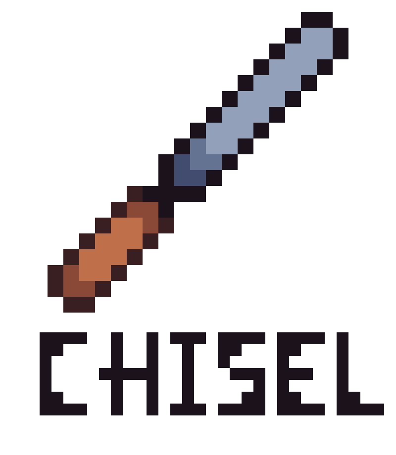

<div align="center">
  <picture>
    <source media="(prefers-color-scheme: dark)" srcset="docs/source/images/logo-light-text.png">
    <source media="(prefers-color-scheme: light)" srcset="docs/source/images/logo-dark-text.png">
    
  </picture>

[](https://github.com/icnatspell/chisel/actions/workflows/ci.yml)
[](https://www.python.org/)
[](https://docs.astral.sh/uv/)
[](https://github.com/astral-sh/ruff)
[](https://github.com/facebook/pyrefly)
[](LICENSE)
</div>

`chisel` is a model compression library. You construct compression workflows from chisel's passes and evaluators; [Microsoft Olive](https://github.com/microsoft/Olive) orchestrates them — handling model loading, pass sequencing, caching, and output export.

## Installation

```bash
uv add chisel
```

## Usage

chisel is driven by Olive workflow configs. The `chisel run` command is a thin wrapper around `olive run` that ensures chisel's passes and evaluators are registered before Olive starts:

```bash
chisel run --config path/to/workflow.yaml
```

A minimal structured-pruning config looks like:

```yaml
input_model:
  type: HfModel
  model_path: microsoft/resnet-50
  task: image-classification

passes:
  pruning:
    type: TorchPruningPass
    config:
      pruning_ratio: 0.10
      importance: lamp
      global_pruning: true

engine:
  output_dir: outputs/pruned
```

See [`examples/`](examples/) for complete end-to-end workflows including evaluation and knowledge-distillation fine-tuning.

## Examples

| Example | Model | What it shows |
|---------|-------|---------------|
| [`examples/hf/microsoft-resnet-50/`](examples/hf/microsoft-resnet-50/) | `microsoft/resnet-50` | Prune → Eval → Fine-tune (Plain, KD) |
| [`examples/torch/torchvision-resnet-50/`](examples/torch/torchvision-resnet-50/) | `torchvision.models.resnet50` | Prune → Eval → Fine-tune (Plain, KD) |

## Development

```bash
git clone https://github.com/icnatspell/chisel.git && cd chisel && uv sync
```

```bash
just check   # lint, format, type-check
just test    # pytest with coverage
just build   # build sdist + wheel
```

Run `just` with no arguments to see all tasks.

### Pre-commit hooks

```bash
just hooks   # install hooks and run on all files
```

### Continuous integration

Lint, type-check, and tests run on every push and pull request via GitHub Actions (`.github/workflows/ci.yml`). Coverage must stay at or above 80%.

## License

[MIT](LICENSE)
